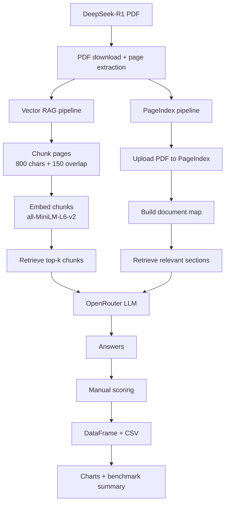

# RAG Shootout: Vector RAG vs PageIndex


> A practical benchmark for answering one question: **do we always need vector search for RAG, or can document-map retrieval do better on dense research papers?**

RAG Shootout is a Python project that compares two retrieval strategies on the same real-world document, the [DeepSeek-R1 paper](https://arxiv.org/abs/2501.12948):

- **Vector RAG**: chunk the PDF, embed every chunk, retrieve the nearest chunks, and pass them to an LLM.
- **PageIndex**: upload the full PDF, let PageIndex build a document map, and retrieve relevant sections through structure-aware reasoning.

The goal is not to crown a universal winner. It is to expose where each retrieval method succeeds or fails across factual lookup, numeric retrieval, synthesis, and narrative questions. Answers are scored manually against the source paper to avoid LLM self-grading bias.

---

## ✨ Features

- 🔍 **Head-to-head RAG benchmark** comparing Vector RAG and PageIndex on identical questions.
- 📄 **Real research-paper workload** using the DeepSeek-R1 arXiv PDF instead of toy documents.
- 🧠 **Four stress-test questions** covering factual recall, numeric lookup, full synthesis, and narrative retrieval.
- 📊 **Manual scoring framework** for accuracy, completeness, and faithfulness.
- ⏱️ **Latency tracking** for each pipeline and question.
- 📈 **Visualization utilities** for score, win-count, dimension-average, category, and latency charts.
- 🧪 **Unit tests** for core PDF, scoring, and vector pipeline behavior.
- 🧰 **Notebook-first workflow** plus a CLI benchmark runner for repeatable experiments.
- 🔁 **Reusable configuration** for swapping documents, models, chunk sizes, and retrieval settings.

---

## 🎬 Demo

> Demo recording placeholder. Add a walkthrough GIF at `docs/demo.gif` after recording the notebook or CLI flow.


---

## 🧱 Architecture



### Components

| Component | Path | Responsibility |
|---|---|---|
| Configuration | `src/rag_shootout/config.py` | Centralizes PDF URL, model, API keys, chunking, retrieval, and scoring settings. |
| PDF utilities | `src/rag_shootout/pdf_utils.py` | Downloads the PDF, extracts page text, and creates overlapping text chunks. |
| Vector RAG | `src/rag_shootout/vector_pipeline.py` | Embeds chunks with `sentence-transformers`, retrieves top-k chunks, and asks the LLM. |
| PageIndex RAG | `src/rag_shootout/pageindex_pipeline.py` | Uploads the PDF to PageIndex and asks questions using vectorless document retrieval. |
| Benchmark questions | `src/rag_shootout/questions.py` | Defines the current 4-question evaluation set. |
| Scoring | `src/rag_shootout/scoring.py` | Provides `DimensionScore`, scorecards, summary metrics, and DataFrame conversion. |
| Visualization | `src/rag_shootout/visualization.py` | Renders score, win-count, category, dimension, and latency charts. |
| Notebook workflow | `notebooks/rag_shootout.ipynb` | End-to-end interactive benchmark, scoring, and charting workflow. |
| CLI workflow | `scripts/run_benchmark.py` | Runs the benchmark from the terminal and writes results to `results/`. |

---

## 🧪 Benchmark Design

The current benchmark uses 4 questions from the DeepSeek-R1 paper:

| # | Type | What It Tests |
|---|---|---|
| 1 | Simple factual | Whether the pipeline can retrieve a direct algorithmic fact. |
| 2 | Exact number | Whether it can find precise benchmark values without losing table context. |
| 3 | Full synthesis | Whether it can combine information spread across multiple sections. |
| 4 | Narrative retrieval | Whether it can find and explain a specific named event in the paper. |

### Benchmark Metrics

| Metric | What It Measures | How This Project Uses It |
|---|---|---|
| Accuracy | Whether the answer is factually correct against the source paper. | Manual 1-5 score in `DimensionScore.accuracy`. |
| Latency | How long each pipeline takes to answer. | Captured as `vector_time` and `pageindex_time` in benchmark results. |
| Faithfulness | Whether claims are grounded in the retrieved/source content. | Manual 1-5 score in `DimensionScore.faithfulness`. |
| Context Precision | Whether retrieved context is mostly relevant rather than noisy. | Reviewed from retrieved pages/sections and answer grounding during manual evaluation. |
| Context Recall | Whether retrieval found enough evidence to fully answer the question. | Reflected in completeness and source review, especially for synthesis questions. |

---

## ⚔️ Vector RAG vs PageIndex

| Dimension | Vector RAG | PageIndex |
|---|---|---|
| Retrieval strategy | Semantic similarity over embedded chunks. | Structure-aware retrieval over a document map. |
| Setup | Local chunking plus embedding model. | Upload document to PageIndex and reuse the document ID. |
| Strengths | Fast, transparent, cheap to run locally after indexing. | Better suited to long documents, section reasoning, and cross-page context. |
| Weaknesses | Can miss answers split across chunks or buried outside top-k. | Depends on PageIndex availability, credits, API latency, and document upload. |
| Best for | High-throughput retrieval, simple lookups, controllable local experiments. | Dense reports, papers, manuals, and questions needing document structure. |
| Main trade-off | Simplicity and speed vs. context fragmentation. | Better document awareness vs. external service dependency. |

---

## 📊 Results

Run the notebook or CLI, fill in the scorecard, then save benchmark screenshots here:

| Screenshot | Placeholder |
|---|---|
| Score per question | `docs/results/scores_per_question.png` |
| Win counts | `docs/results/win_counts.png` |
| Dimension averages | `docs/results/dimension_averages.png` |
| Latency comparison | `docs/results/latency.png` |

```md


```

### Current Notes

- The scorecard supports a maximum score of **60 points** per pipeline: 4 questions x 15 points each.
- PageIndex requires a valid `PAGEINDEX_API_KEY` and available credits.
- Vector RAG uses `all-MiniLM-L6-v2` embeddings with `top_k=5` by default.

---

## 📁 Project Structure

```text
rag-shootout/
├── notebooks/
│   └── rag_shootout.ipynb          # Interactive benchmark workflow
├── src/
│   └── rag_shootout/
│       ├── __init__.py
│       ├── config.py               # Settings, API keys, models, chunking
│       ├── pdf_utils.py            # PDF download, extraction, chunking
│       ├── vector_pipeline.py      # Vector RAG implementation
│       ├── pageindex_pipeline.py   # PageIndex implementation
│       ├── questions.py            # 4 benchmark questions
│       ├── scoring.py              # Manual scorecard + summary metrics
│       └── visualization.py        # Matplotlib benchmark charts
├── scripts/
│   └── run_benchmark.py            # CLI benchmark runner
├── tests/
│   ├── conftest.py
│   ├── test_pdf_utils.py
│   ├── test_scoring.py
│   └── test_vector_pipeline.py
├── docs/
│   └── methodology.md              # Benchmark design notes
├── results/                        # Generated CSV outputs
├── requirements.txt
├── pyproject.toml
├── .env.example
├── LICENSE
└── README.md
```

---

## 🚀 Installation

### 1. Clone the repository

```bash
git clone https://github.com/YOUR_USERNAME/rag-shootout.git
cd rag-shootout
```

### 2. Create a virtual environment

```bash
python -m venv .venv
```

Windows:

```powershell
.\.venv\Scripts\Activate.ps1
```

macOS / Linux:

```bash
source .venv/bin/activate
```

### 3. Install dependencies

```bash
pip install -r requirements.txt
```

For editable development:

```bash
pip install -e ".[dev]"
```

### 4. Configure API keys

```bash
cp .env.example .env
```

Fill in:

```env
OPENROUTER_API_KEY=your_openrouter_key_here
PAGEINDEX_API_KEY=your_pageindex_key_here
```

You need:

- [OpenRouter](https://openrouter.ai) for LLM inference.
- [PageIndex](https://pageindex.ai) for vectorless document retrieval.

---

## ▶️ Usage

### Option A: Run the notebook

```bash
jupyter lab notebooks/rag_shootout.ipynb
```

Then run the notebook cells in order:

1. Download and parse the DeepSeek-R1 PDF.
2. Build the Vector RAG index.
3. Upload the PDF to PageIndex.
4. Run both pipelines on the 4 benchmark questions.
5. Fill or adjust the manual scorecard.
6. Generate summary tables and charts.

### Option B: Run from the CLI

```bash
python scripts/run_benchmark.py
```

Write to a custom CSV:

```bash
python scripts/run_benchmark.py --output results/my_run.csv
```

Run only selected questions:

```bash
python scripts/run_benchmark.py --questions 1 3 4
```

Run only Vector RAG when PageIndex is unavailable:

```bash
python scripts/run_benchmark.py --skip-pageindex
```

Reuse an existing PageIndex document ID:

```bash
python scripts/run_benchmark.py --pageindex-doc-id YOUR_DOC_ID
```

---

## 🛠️ Tech Stack

| Area | Tools |
|---|---|
| Language |  |
| Notebook |  |
| LLM API |  |
| Embeddings |  |
| PDF parsing |  |
| Vectorless retrieval |  |
| Data |  |
| Charts |  |
| Testing |  |

---

## 🧑‍🔬 Try Your Own Document

To benchmark another PDF:

1. Change `PDF_URL` in `src/rag_shootout/config.py`.
2. Replace the question list in `src/rag_shootout/questions.py`.
3. Re-run the notebook or CLI.
4. Score the outputs manually against the new source document.

Useful config knobs:

| Setting | Default | Purpose |
|---|---:|---|
| `CHUNK_SIZE` | `800` | Characters per Vector RAG chunk. |
| `CHUNK_OVERLAP` | `150` | Overlap between consecutive chunks. |
| `TOP_K` | `5` | Number of chunks retrieved per Vector RAG query. |
| `MODEL` | `qwen/qwen3.5-122b-a10b` | OpenRouter model used for answer generation. |
| `EMBEDDING_MODEL` | `all-MiniLM-L6-v2` | SentenceTransformers embedding model. |

---

## ✅ Testing

```bash
pytest tests/ -v
```

The project also includes coverage settings in `pyproject.toml`, so install the development dependencies if coverage flags are enabled:

```bash
pip install -e ".[dev]"
pytest tests/ -v
```

---

## 🗺️ Future Improvements

- Add automated context precision and context recall scoring from retrieved evidence.
- Save retrieved PageIndex sections in the benchmark CSV for easier auditability.
- Add a Streamlit or Gradio demo for interactive document shootouts.
- Support multiple PDFs and aggregate benchmark runs.
- Add cost tracking for LLM and retrieval API calls.
- Export chart images automatically into `docs/results/`.
- Add CI with linting, tests, and README asset validation.
- Compare additional retrieval baselines such as BM25, hybrid search, and reranking.

---

## 📜 License

MIT License. See [LICENSE](LICENSE).
